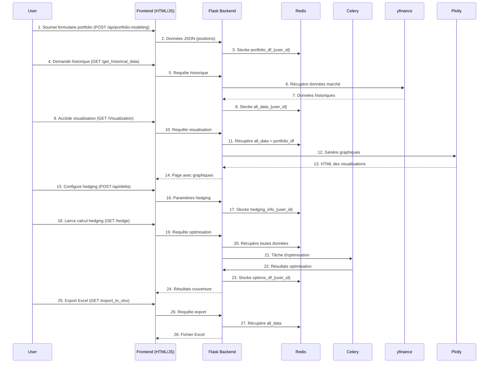

# HedgingSimulator


# Stratégie de Couverture du Portefeuille

## 1. Chargement des Données
- **Données d'Actifs** (`all_data`)
- **Données des Options** (`options_df`)
- **Informations de Couverture** (`hedging_info`)
- **Données sur le Portefeuille Actuel** (`enriched_portfolio_data`)
  - Contient les informations sur les positions actuelles en actions

## 2. Calcul de l'Exposition du Portefeuille
- **Exposition totale si coveringpart == "All"**
  - Calculé comme la somme des valeurs des positions en actions du portefeuille
- **Exposition partielle selon coveringpart spécifié**
  - Calculé en fonction des positions spécifiques (`StockID`)

### Détails du calcul de l'exposition pour chaque action :
- **Exposition pour chaque action** :
  - **Valeur des Positions** : Calcul de l'exposition d'une action en fonction de la quantité détenue et de la valeur actuelle de l'action.
    - Exemple : `exposure_action = position_quantity * current_price`
  - **PositionValue** : Utilisation de la colonne `PositionValue` dans `enriched_portfolio_data` pour obtenir l'exposition en valeur de chaque position.
    - Exemple : `exposure_action = enriched_portfolio_df['PositionValue']`
  - **Couverture en fonction du type de couverture** : L'exposition de chaque action peut être ajustée selon la couverture choisie (delta, gamma, etc.).
    - Exemple : Pour delta-hedging, l'exposition à chaque action pourrait être ajustée en fonction du delta associé à cette action.
- **Exposition dynamique selon le type de couverture**
  - L'exposition du portefeuille est ajustée pour chaque action en fonction du type de couverture (delta, gamma, etc.).

## 3. Calcul des Matrices de Covariance et de Corrélation
- **Matrice de Covariance** (liens entre actifs)
  - Utilisée pour estimer les risques et la volatilité du portefeuille
- **Matrice de Corrélation** (force des relations entre actifs)
  - Utilisée pour évaluer la diversification entre les actifs

### Nouvelle utilisation des matrices pour optimiser la couverture
- **Utilisation de la Matrice de Covariance pour Calculer le Risque Global**
  - Contraintes sur le risque total du portefeuille (ex. `quad_form(x, cov_matrix)`)
- **Utilisation de la Matrice de Corrélation pour Ajuster les Poids des Options**
  - Ajustement des poids pour réduire l'impact des actifs fortement corrélés

## 4. Optimisation de la Couverture
- **Objectif : Minimiser l'Écart à Zéro (grecs)**
  - **Delta-Hedging** : Minimiser Delta
  - **Gamma-Hedging** : Minimiser Gamma
  - **Vega-Hedging** : Minimiser Vega
  - **Theta-Hedging** : Minimiser Theta
- **Contraintes :**
  - Couverture Cible (exposition cible)
  - Liquidité (contraintes sur l'intérêt ouvert)
  - Diversification (Call et Put)
  - Neutralisation des Grecs
- **Résolution de l'Optimisation** (CVXPY)

## 5. Calcul Dynamique de l'Exposition
- **Calcul initial de l'exposition du portefeuille**
  - Si `coveringpart == "All"` : Exposition totale du portefeuille
  - Si `coveringpart` spécifié : Exposition partielle selon les actifs ciblés
- **Ajustement dynamique de l'exposition selon le type de couverture choisi :**
  - **Delta-Hedging** : Neutralisation de la sensibilité au prix de l'actif sous-jacent
  - **Gamma-Hedging** : Neutralisation de la variation du delta
  - **Vega-Hedging** : Neutralisation de la sensibilité à la volatilité
  - **Theta-Hedging** : Neutralisation de la perte de valeur au fil du temps
- **Exemple de calcul dynamique :**
  - `portfolio_exposure * target_coverage` (ajusté selon la couverture)

## 6. Résultats et Evaluation
- **Quantité optimale d'options**
- **Coût total de la couverture**
- **Volatilité du portefeuille et corrélation des actifs**
- **Risque global du portefeuille** (calculé avec la covariance)
- **Ajustement des options en fonction des corrélations et des risques globaux**
- **Performance de la couverture** (comparaison avant-après couverture)

## 7. Retour au Frontend (affichage des résultats)
- Stratégie optimale et options sélectionnées
- Coût de la couverture et exposition cible
- Volatilité et risques résiduels
- Résultats visuels sur la couverture (graphiques et tableaux)


# Visualisation des Échanges de Données dans l'Application

## Diagramme Mermaid : Échanges entre Utilisateur, Frontend, Flask Backend, Redis, Celery, yfinance, et Plotly

Voici une visualisation des échanges de données dans votre application, représentée sous forme de diagramme Mermaid :

### Diagramme des échanges (Sequence Diagram)




### Flux Analytique

Voici le diagramme Mermaid représentant le flux analytique dans l'application, montrant comment les requêtes sont enregistrées, analysées en temps réel, et affichées sur le tableau de bord Plotly :


```mermaid
graph TD
    A[Stratégie de Couverture du Portefeuille] --> B[1. Chargement des Données]
    B --> B1[Données d'Actifs (all_data)]
    B --> B2[Données des Options (options_df)]
    B --> B3[Informations de Couverture (hedging_info)]
    B --> B4[Données sur le Portefeuille Actuel (enriched_portfolio_data)]
    B4 --> B4_1[Contient les informations sur les positions actuelles en actions]

    A --> C[2. Calcul de l'Exposition du Portefeuille]
    C --> C1[Exposition totale si coveringpart == "All"]
    C1 --> C1_1[Calculé comme la somme des valeurs des positions en actions du portefeuille]
    C --> C2[Exposition partielle selon coveringpart spécifié]
    C2 --> C2_1[Calculé en fonction des positions spécifiques (StockID)]
    
    C --> D[Détails du calcul de l'exposition pour chaque action]
    D --> D1[Exposition pour chaque action]
    D1 --> D1_1[Valeur des Positions : Calcul de l'exposition d'une action en fonction de la quantité détenue et de la valeur actuelle de l'action]
    D1_1 --> D1_2[exposure_action = position_quantity * current_price]
    D1 --> D1_2[PositionValue : Utilisation de la colonne PositionValue dans enriched_portfolio_data pour obtenir l'exposition en valeur de chaque position]
    D1_2 --> D1_3[exposure_action = enriched_portfolio_df['PositionValue']]
    D1 --> D1_3[Couverture en fonction du type de couverture]
    D1_3 --> D1_4[Exposition ajustée selon la couverture choisie (delta, gamma, etc.)]

    C --> E[Exposition dynamique selon le type de couverture]
    E --> E1[L'exposition du portefeuille est ajustée pour chaque action selon le type de couverture]

    A --> F[3. Calcul des Matrices de Covariance et de Corrélation]
    F --> F1[Matrice de Covariance (liens entre actifs)]
    F1 --> F1_1[Utilisée pour estimer les risques et la volatilité du portefeuille]
    F --> F2[Matrice de Corrélation (force des relations entre actifs)]
    F2 --> F2_1[Utilisée pour évaluer la diversification entre les actifs]
    
    F --> G[Nouvelle utilisation des matrices pour optimiser la couverture]
    G --> G1[Utilisation de la Matrice de Covariance pour Calculer le Risque Global]
    G1 --> G1_1[Contraintes sur le risque total du portefeuille]
    G --> G2[Utilisation de la Matrice de Corrélation pour Ajuster les Poids des Options]
    G2 --> G2_1[Ajustement des poids pour réduire l'impact des actifs fortement corrélés]

    A --> H[4. Optimisation de la Couverture]
    H --> H1[Objectif : Minimiser l'Écart à Zéro (grecs)]
    H1 --> H1_1[Delta-Hedging : Minimiser Delta]
    H1 --> H1_2[Gamma-Hedging : Minimiser Gamma]
    H1 --> H1_3[Vega-Hedging : Minimiser Vega]
    H1 --> H1_4[Theta-Hedging : Minimiser Theta]

    H --> H2[Contraintes]
    H2 --> H2_1[Couverture Cible (exposition cible)]
    H2 --> H2_2[Liquidité (contraintes sur l'intérêt ouvert)]
    H2 --> H2_3[Diversification (Call et Put)]
    H2 --> H2_4[Neutralisation des Grecs]
    
    H --> H3[Résolution de l'Optimisation (CVXPY)]

    A --> I[5. Calcul Dynamique de l'Exposition]
    I --> I1[Calcul initial de l'exposition du portefeuille]
    I1 --> I1_1[Si coveringpart == "All" : Exposition totale du portefeuille]
    I1 --> I1_2[Si coveringpart spécifié : Exposition partielle selon les actifs ciblés]

    I --> I2[Ajustement dynamique de l'exposition selon le type de couverture choisi]
    I2 --> I2_1[Delta-Hedging : Neutralisation de la sensibilité au prix de l'actif sous-jacent]
    I2 --> I2_2[Gamma-Hedging : Neutralisation de la variation du delta]
    I2 --> I2_3[Vega-Hedging : Neutralisation de la sensibilité à la volatilité]
    I2 --> I2_4[Theta-Hedging : Neutralisation de la perte de valeur au fil du temps]

    I --> I3[Exemple de calcul dynamique]
    I3 --> I3_1[portfolio_exposure * target_coverage (ajusté selon la couverture)]

    A --> J[6. Résultats et Evaluation]
    J --> J1[Quantité optimale d'options]
    J --> J2[Coût total de la couverture]
    J --> J3[Volatilité du portefeuille et corrélation des actifs]
    J --> J4[Risque global du portefeuille (calculé avec la covariance)]
    J --> J5[Ajustement des options en fonction des corrélations et des risques globaux]
    J --> J6[Performance de la couverture (comparaison avant-après couverture)]

    A --> K[7. Retour au Frontend (affichage des résultats)]
    K --> K1[Stratégie optimale et options sélectionnées]
    K --> K2[Coût de la couverture et exposition cible]
    K --> K3[Volatilité et risques résiduels]
    K --> K4[Résultats visuels sur la couverture (graphiques et tableaux)]
```
